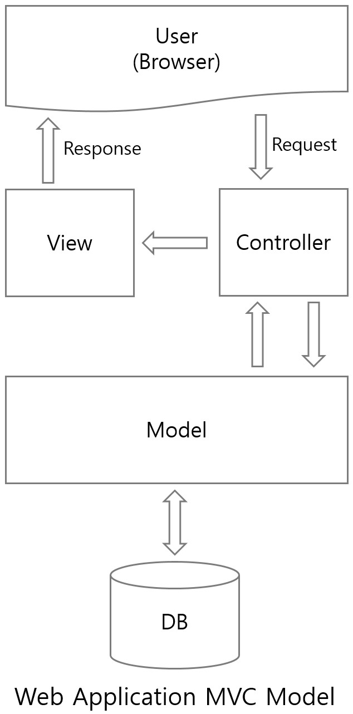
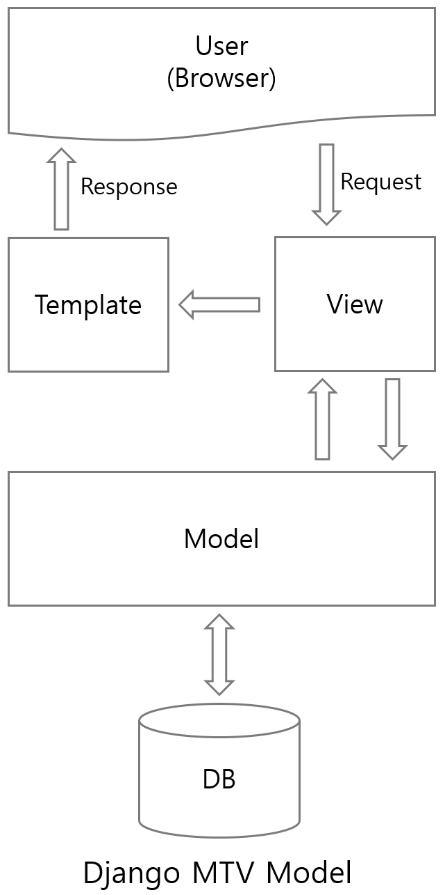
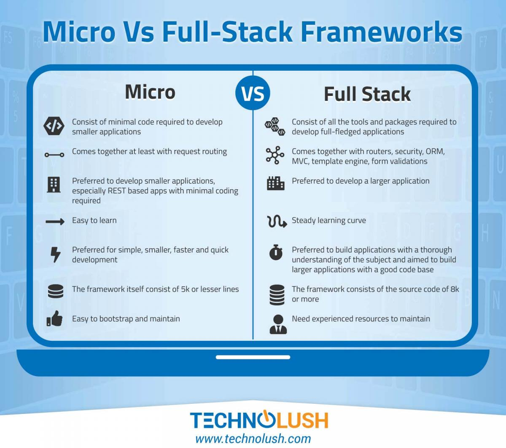
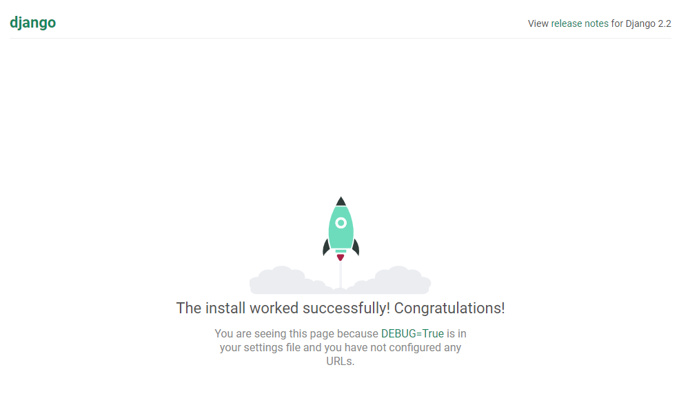

# Django 시작하기

## Django 소개
> Django makes it easier to build better Web apps more quickly and with less code.

Django는 빠른 개발과 깨끗하고 실용적인 디자인을 장려하는 고급 python 웹 프레임워크입니다.  
2003년 Lawrence Journal-World newpaper의 웹 개발팀이 파이썬으로 만든 어플리케이션에서 시작되었습니다.  
2005년 오픈소스로 공개되어 구글앱엔진, 인스타그램 등에서 채택되어 사용되고있습니다.  

### 왜 장고인가?
장고로 시작하면 웹어플리케이션의 개념부터 시작하여 몇시간 만에 시작할 수 있습니다.  
장고는 웹 개발의 번거로움을 덜어 주므로 나의 앱을 작성하는데 집중할 수 있도록 도와줍니다.
- 참고  
https://www.djangoproject.com/start/overview

## MVC 패턴과 MTV
웹프로그래밍에서 자주 사용하는 패턴으로 Model-View-Controller를 의미합니다.
- Model: DB의 구조를 결정하고 데이터를 담는 역할.  
- View: 사용자에게 보여지는 UI를 담당  
- Controller: 기능을 구현하고 비지니스를 명세화 

장고에서도 MVC 패턴을 적용하여 어플리케이션을 구현합니다.  
하지만 각각에 해당하는 장고의 명칭은 Model(:Model)-Template(:View)-View(:Controller) 로, 
View의 의미가 일반적인 MVC 패턴에서 말하는 'Controller'의 역할을 합니다.

|  |  |
|:--------:|:--------:|
|  |  |
|  |  |

- 참고  
[Django appears to be a MVC framework, but you call the Controller the “view”, and the View the “template”. How come you don’t use the standard names?](https://docs.djangoproject.com/en/2.2/faq/general/#django-appears-to-be-a-mvc-framework-but-you-call-the-controller-the-view-and-the-view-the-template-how-come-you-don-t-use-the-standard-names)  

## Full-stack Framework VS Micro Framework

- 참고  
[Micro Vs Full-Stack Frameworks](https://www.technolush.com/blog/micro-vs-full-stack-frameworks)  

### Django Vs Flask
- Django ORM vs SQLAlchemy
- Form vs flask-wtf
- Template Engine vs Jinja2
- Admin Page vs flask-admin
- south(migrate, makemigrations) vs alembic
- Middleware vs before_request, after_request
- manage.py vs flask-scripts
- manage.py test vs unittest or flask-test
- def view(request) vs flask.request
- django.contrib.messages vs flask.flash  

장고 대 플라스트는 풀스택 프레임워크 대 마이크로 프레임워크로 비교하는것과 동일합니다.
어느것이 좋다라기 보다는 어느 시나리오, 어느 서비스냐에 따라 목적에 맞게 팀에 필요한 프레임워크를 현명하게 선택하는것이 중요합니다.

- 참고  
[Differences Between Django vs Flask](https://www.educba.com/django-vs-flask/)  
[Flask vs Django: choosing Python Framework](https://www.merixstudio.com/blog/flask-vs-django-choosing-python-framework/)  

## Django 설치
1. 파이썬설치  
    - 파이썬 다운로드 url : https://www.python.org/downloads  
1. Django 패키지 설치
    ```
    $ pip install django
    ```
    ```
    $ pip install --proxy http://70.10.15.10:8080 django
    Collecting django
    Downloading https://files.pythonhosted.org/packages/eb/4b/743d5008fc7432c714d753e1fc7ee56c6a776dc566cc6cfb4136d46cdcbb/Django-2.2.2-py3-none-any.whl (7.4MB)
        100% |████████████████████████████████| 7.5MB 479kB/s
    Collecting sqlparse (from django)
    Downloading https://files.pythonhosted.org/packages/ef/53/900f7d2a54557c6a37886585a91336520e5539e3ae2423ff1102daf4f3a7/sqlparse-0.3.0-py2.py3-none-any.whl
    Collecting pytz (from django)
    Downloading https://files.pythonhosted.org/packages/3d/73/fe30c2daaaa0713420d0382b16fbb761409f532c56bdcc514bf7b6262bb6/pytz-2019.1-py2.py3-none-any.whl (510kB)
        100% |████████████████████████████████| 512kB 603kB/s
    Installing collected packages: sqlparse, pytz, django
    Successfully installed django-2.2.2 pytz-2019.1 sqlparse-0.3.0
    You are using pip version 18.1, however version 19.1.1 is available.
    You should consider upgrading via the 'python -m pip install --upgrade pip' command.
    ```

## Django 프로젝트 생성
1. 장고프로젝트를 생성한다.  
    - 방법1. 현재디렉토리에 mysite 프로젝트를 생성합니다.  
    - mysite라는 디렉토리가 생성되고 내부에 같은 이름의 설정 디렉토리가 내부에 생성됩니다.  
    ```
    $ django-admin startproject mysite
    ```
    - 벙법2. 현재디렉토리를 프로젝트 root로 mysite라는 설정 디렉토리가 내부에 생성됩니다.  
    ```
    $ django-admin startproject mysite .
    ```
1. ```manage.py``` 가 있는 폴더로 이동합니다.(위 방법1 의 경우, mysite 디렉토리 내부)
    ```
    $ cd mysite
    ```
1. django server 실행  
    python manage.py 명령어를 사용하여 django server를 실행합니다.  
    ```
    $ python manage.py runserver
    ```
    browser에서 "http://localhost:8000"를 실행합니다.  
    
1. 포트 변경하기  
    장고는 기본적으로 내부 IP에  8000번 포트를 사용하여 개발서버를 구동합니다. 아래와 같이 커맨드라인 파라미터로 포트를 변경할 수 있습니다.
    ```
    $ python manage.py runserver 8080
    ```
## Django 프로젝트 구조
<pre>
mysite/
    manage.py
    mysite/
        __init__.py
        settings.py
        urls.py
        wsgi.py
</pre>
- mysite/  
    - 최상단 디렉토리는 단순히 프로젝트를 담는 공간으로, Django 와 무관하게 원하는 이름으로 변경가능합니다.  
- manage.py  
    - Django 프로젝트와 다양한 방법으로 상호작용 하는 커맨드라인의 유틸리티로 임의로 변경하지 않도록 주의합니다.  
    - [django-admin and manage.py](https://docs.djangoproject.com/en/2.2/ref/django-admin/) 참고.  
- mysite/  
    - 내부 mysite 디렉토리에는 프로젝트를 위한 설정파일과 웹 서비스 실행을 위한 파일등, 실제 Python 패키지들이 저장됩니다. 
    - 이 디렉토리 내의 이름을 이용하여, (mysite.urls 와 같은 식으로) 프로젝트의 어디서나 Python 패키지들을 임포트 하는데 사용합니다.  
    - 프로젝트 생성후에 이름을 변경하면 귀찮은 작업이 생기므로 변경하지 않도록 잘 결정하는것이 좋습니다.
- mysite/\_\_init\_\_.py  
    - Python으로 하여금 이 디렉토리를 패키지처럼 다루라고 알려주는 용도의 단순한 빈 파일입니다.  
    - Python 공식 홈페이지 [Packages](https://docs.python.org/3/tutorial/modules.html#tut-packages) 참고.   
- mysite/settings.py  
    - 현재 Django 프로젝트의 환경 및 구성과 관련된 설정을 저장합니다. 
    - [Django settings](https://docs.djangoproject.com/en/2.2/topics/settings/)참고.   
- mysite/urls.py  
    - 현재 Django project 의 URL 관련된 설정 및 매핑정보 저장합니다.  
    - 프로젝트 내에 여러개의 urls파일을 작성하게 되며 그 첫 시작점이 ```mysite/urls.py``` 가 됩니다.  (```settins.py```에서 변경가능)  
    - [URL dispatcher](https://docs.djangoproject.com/en/2.2/topics/http/urls/) 참고.  
- mysite/wsgi.py  
    - 현재 프로젝트를 웹 서비스하기 위한 WSGI 관련 설정으로. 되도록 수정이나 삭제하지 않습니다.
    - [How to deploy with WSGI](https://docs.djangoproject.com/en/2.2/howto/deployment/wsgi/) 참고.  

## Django 앱 생성
프로젝트가 root 경로에서 app을 하나 생성합니다.
```
python manage.py startapp news
```
## Django 앱 구조
<pre>
mysite/
    manage.py
    mysite/
    news/
        migrations/
        __init__.py
        admin.py
        apps.py
        models.py
        tests.py
        views.py
</pre>
- models.py
    - 장고에서 DB의 명세를 관리하기 위해 사용하는 파일
    - 속성 및 컬럼의 데이터 타입, 제약사항등을 정의하고 Django ORM 기능을 사용합니다.
- admin.py
    - model을 이용해 DB테이블이 생성되면 이에 대한 CRUD등을 수행할 수 있도록 해주는 어드민 설정기능
    - Django의 기본 관리자 페이지를 통해 생성한 모델(DB 테이블)을 확인해 볼수 있습니다.
- views.py
    - 기능에 대한 구현부, 데이터를 가공하고 원하는 비지니스로직을 구현합니다.
    - Class Based view와 Function Based view 두가지가 있습니다. 
- apps.py
    - Django 앱에 대한 설정파일
    - Django AppConfig를 활용하여 내가 만든 앱을 장고프로젝트에 등록하고 활용할 수 있도록 해줍니다.
- urls.py
    - 현재 Django App 의 URL 관련된 설정 및 매핑정보 저장.
    - url을 통한 호출을 어떤 view에 매핑할지를 기록합니다.
    - 보통 프로젝트 urls.py와 각 앱에 해당되는 urls.py로 구성합니다.
- templates
    - Html과 django 템플릿 코드로 작성된 화면 템플릿등을 저장하는 공간입니다.
- migrations
    - Model 변경에 따른 DB의 변경점을 기록해두는 공간입니다. 
    - Django 명령어를 이용해 DB에 모델의 변경내용을 적용할 때 활용합니다.

## Project Vs App
프로젝트와 앱은 무엇이 다를까요?   
- 앱은 특정한 기능(블로그나 공공 기록물을 위한 데이터베이스나, 간단한 설문조사 앱)을 수행하는 웹 어플리케이션을 말합니다.  
- 프로젝트는 이런 특정 웹 사이트를 위한 앱들과 각 설정들을 한데 묶어놓은 것입니다. 프로젝트는 다수의 앱을 포함할 수 있고, 앱은 다수의 프로젝트에 포함될 수 있습니다.  

## Django 기본 명령어
- ```django-admin startproject```  
    - 장고 프로젝트를 생성합니다.
- ```startapp```
    -   프로젝트의 기능단위인 앱을 생성합니다.
- ```makemigrations```
    - 어플리케이션의 변경사항을 추적하여 DB에 적용할 내용을 정리합니다.
- ```sqlmigrate```
    - 실행할 SQL을 출력합니다.
- ```migrate```
    - 변경사항을 DB에 반영합니다.
- ```showmigrations```
    - 프로젝트의 DB 변경사항 목록과 상태를 출력합니다.
- ```runserver```
    - 테스트 서버를 실행합니다.
- ```dumpdata```
    - 현재 DB의 내용을 백업할 때 사용합니다.
- ```loaddata```
    - 백업 파일에서 DB로 내용을 복구합니다.
- ```flush```
    - DB의 스키마는 그대로 두고 데이터만 삭제합니다.
- ```shell```
    - 장고 쉘을 실행한다. 모델등을 로드하여 테스트 해볼수 있습니다.
- ```dbshell```
    - DB에 접근할 수 있는 쉘을 실행한다. SQL을 이용해 직접 수정하고 싶을 경우 사용합니다.
- ```createsuperuser```
    - 관리자 계정을 생성합니다.
- ```changepassword```
    - 계정의 비밀번호를 수정합니다.
