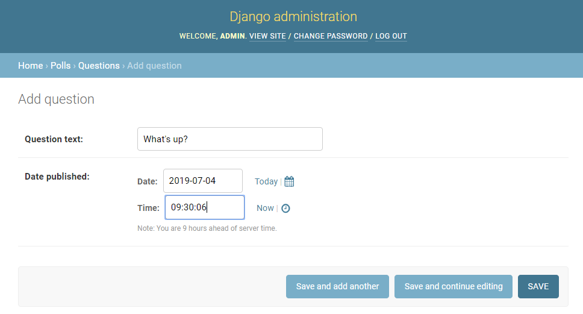
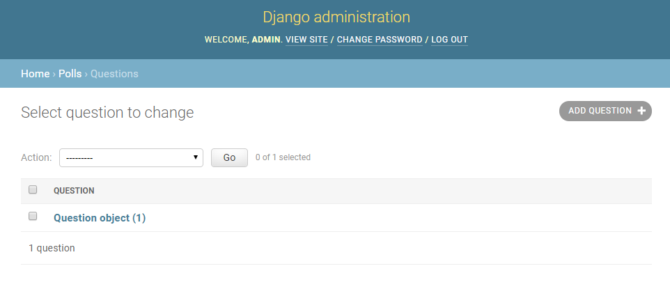
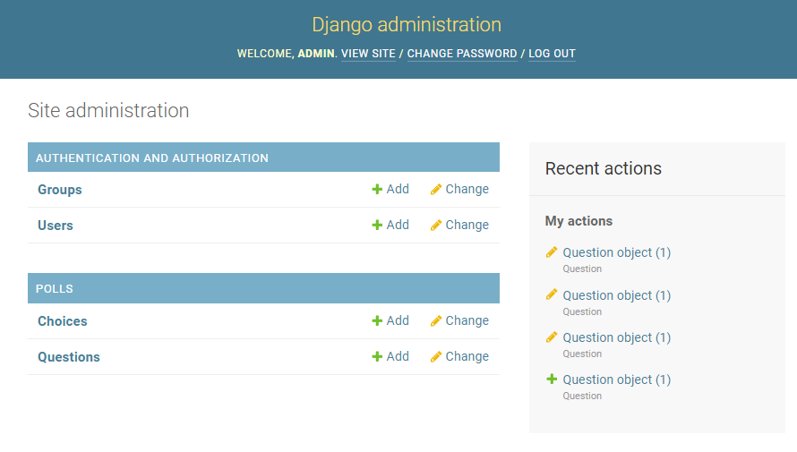
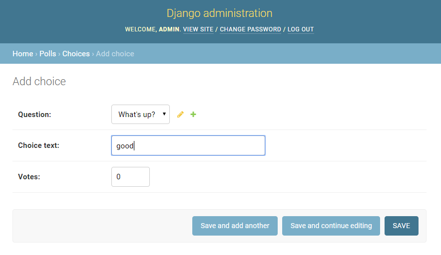
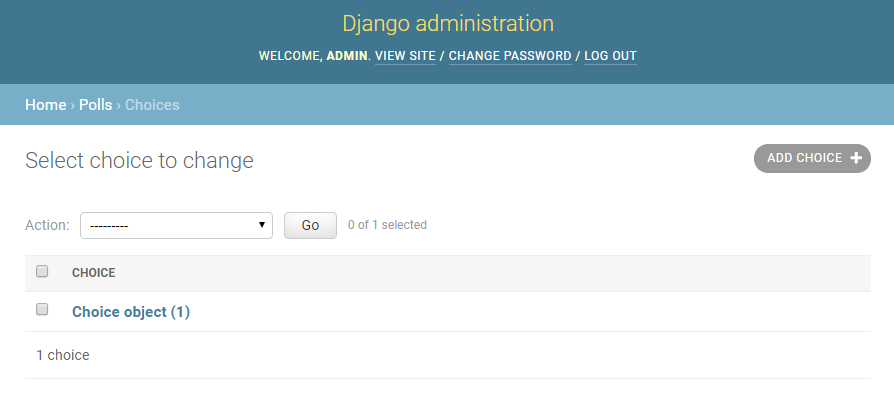

# Django 로 Polls App 만들기

## 데이터베이스 설치
1. Django의 DB 기본설정은 SQLite 입니다.  
SQLite는 Python에서 기본으로 제공하기 때문에 "config/settings.py" 파일을 열어 확인해볼 수 있습니다.
    ```python
    DATABASES = {
        'default': {
            'ENGINE': 'django.db.backends.sqlite3',
            'NAME': os.path.join(BASE_DIR, 'db.sqlite3'),
        }
    }
    ```
1. 데이터베이스를 만들고 초기화 하기 위해 아래 명령을 입력합니다.
    ```
    $ python manage.py migrate
    ```
    ```cmd
    Operations to perform:
    Apply all migrations: admin, auth, contenttypes, sessions
    Running migrations:
    Applying contenttypes.0001_initial... OK
    Applying auth.0001_initial... OK
    Applying admin.0001_initial... OK
    Applying admin.0002_logentry_remove_auto_add... OK
    Applying admin.0003_logentry_add_action_flag_choices... OK
    Applying contenttypes.0002_remove_content_type_name... OK
    Applying auth.0002_alter_permission_name_max_length... OK
    Applying auth.0003_alter_user_email_max_length... OK
    Applying auth.0004_alter_user_username_opts... OK
    Applying auth.0005_alter_user_last_login_null... OK
    Applying auth.0006_require_contenttypes_0002... OK
    Applying auth.0007_alter_validators_add_error_messages... OK
    Applying auth.0008_alter_user_username_max_length... OK
    Applying auth.0009_alter_user_last_name_max_length... OK
    Applying auth.0010_alter_group_name_max_length... OK
    Applying auth.0011_update_proxy_permissions... OK
    Applying sessions.0001_initial... OK
    ```
## 모델 만들기
1. Question 과 Choice 라는 두개의 모델을 만들겠습니다.  
    - Question 은 질문(question) 과 발행일(publication date) 을 위한 두개의 필드를 가집니다.
    - Choice 는 선택지(choice) 와 표(vote) 계산을 위한 두개의 필드를 가집니다. 
    - 각 Choice 모델은 Question 모델과 연관(associated) 됩니다.  

    polls/models.py 파일을 수정하여 다음과 같이 만들어 봅시다.  
    ```python
    from django.db import models

    
    class Question(models.Model):
        question_text = models.CharField(max_length=200)
        pub_date = models.DateTimeField('date published')

        
    class Choice(models.Model):
        question = models.ForeignKey(Question, on_delete=models.CASCADE)
        choice_text = models.CharField(max_length=200)
        votes = models.IntegerField(default=0)
    ```

## 모델 활성화
Django는 모델 정보를 가지고 다음과 같은 일을 할 수 있습니다.  
- 이 앱을 위한 데이터베이스 스키마 생성(CREATE TABLE 문)
- Question과 Choice 객체에 접근하기 위한 Python 데이터베이스 접근 API를 생성  

1. 프로젝트에 polls 앱을 등록합니다.  
"config/settings.py" 파일을 열어 ```INSTALLED_APPS``` 설정에 ```PollsConfig```를 추가합니다.  
```PollsConfig```는 "polls/apps.py" 파일 내에 존재합니다.
    ```python
    INSTALLED_APPS = [
        'polls.apps.PollsConfig',
        'django.contrib.admin',
        'django.contrib.auth',
        'django.contrib.contenttypes',
        'django.contrib.sessions',
        'django.contrib.messages',
        'django.contrib.staticfiles',
    ]
    ```
1. 모델을 변경시킨 사실과(이 경우에는 새로운 모델을 만들었습니다) 이 변경사항을 migration으로 저장시키고 싶다는 것을 Django에게 알려줍니다.
    ```
    $ python manage.py makemigrations polls
    ```
    ```
    Migrations for 'polls':
        polls\migrations\0001_initial.py
            - Create model Question
            - Create model Choice
    ```
1. ```sqlmigration```명령을 이용하여 실행하는 SQL문을 확인해 볼 수 있습니다.
    ```
    $ python manage.py sqlmigrate polls 0001
    ```
    ```
    BEGIN;
    --
    -- Create model Question
    --
    CREATE TABLE "polls_question" (
        "id" integer NOT NULL PRIMARY KEY AUTOINCREMENT, 
        "question_text" varchar(200) NOT NULL, 
        "pub_date" datetime NOT NULL
    );
    --
    -- Create model Choice
    --
    CREATE TABLE "polls_choice" (
        "id" integer NOT NULL PRIMARY KEY AUTOINCREMENT, 
        "choice_text" varchar(200) NOT NULL, 
        "votes" integer NOT NULL, 
        "question_id" integer NOT NULL REFERENCES "polls_question" ("id") DEFERRABLE INITIALLY DEFERRED
    );
    CREATE INDEX "polls_choice_question_id_c5b4b260" ON "polls_choice" ("question_id");
    COMMIT;
    ```

1. migrate 를 실행시켜 데이터베이스에 모델과 관련된 테이블을 생성합니다.
    ```
    $ python manage.py migrate
    ```
    ```
    Operations to perform:
    Apply all migrations: admin, auth, contenttypes, polls, sessions
    Running migrations:
    Applying polls.0001_initial... OK
    ```

## 관리자 생성하기 
1. 관리사이트에 로그인하기 위해 관리자 계정이 필요합니다. 다음을 수행합니다.
    ```
    $ python manage.py createsuperuser
    ```
1. 원하는 username 을 입력합니다.
    ```
    Username: admin
    ```
1. 원하는 이메일 주소를 입력합니다.
    ```
    Email address: admin@example.com
    ```
1. 암호를 입력합니다.
    ```
    Password: 
    Password (again): 
    Superuser created successfully.
    ```
1. 암호의 보안성이 낮다면 아래와 같은 메세지가 함께 출력됩니다. 'y'를 입력하여 설정을 저장합니다.
    ```
    Password:
    Password (again):
    The password is too similar to the username.
    This password is too short. It must contain at least 8 characters.
    This password is too common.
    Bypass password validation and create user anyway? [y/N]: y
    Superuser created successfully.
    ```
1. 개발서버를 구동합니다.
    ```
    $ python manage.py runserver
    ```
1.  http://127.0.0.1:8000/admin/ 으로 접근하여 로그인 할 수 있습니다.  
    
1. 생성한 슈퍼유저(superuser) 계정으로 로그하여 Django 관리자 페이지를 확인할 수 있습니다.  
    

## 관리자 페이지에서 Question 모델을 관리하기
1. 관리자 페이지에서 Question 모델을 관리하려면 등록이 필요합니다.  
"polls/admin.py" 파일을 열어 다음 코드를 입력합니다.   
    ```python
    from django.contrib import admin
    from .models import Question

    admin.site.register(Question)
    ```
    Django 관리자 페이지에 Question이 나타나는것을 확인 할 수 있습니다.  
      
1. "Questions" 클릭 -> "ADD QUESTION"클릭하여 질문을 추가하세요.  
    
1. "SAVE"를 클릭하여 저장합니다.  
    

## 관리자 페이지에서 Choice 모델을 관리하기
1. 관리자 페이지에서 Choice 모델을 관리하려면 등록이 필요합니다.  
"polls/admin.py" 파일을 열어 다음 코드를 입력합니다.  
    ```python
    from django.contrib import admin
    from .models import Question, Choice

    admin.site.register(Question)
    admin.site.register(Choice)
    ```
    Django 관리자 페이지에 Choice가 나타나는것을 확인 할 수 있습니다.  
      
1. "Choices" 클릭 -> "ADD CHOICE"클릭하여 질문의 답을 추가하세요.
    
1. "SAVE"를 클릭하여 저장합니다.
    


