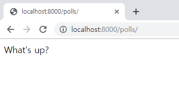
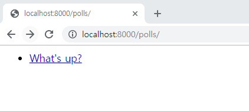

# Django 로 Polls App 만들기

## 여러가지 뷰 추가하기(1/4)
Poll app 에서는 다음과 같은 뷰를 통해 기능을 구현합니다.  
- 투표 목록: 등록된 투표의 목록을 표시하고 상세페이지로 이동하는 링크 제공
- 투표 상세: 투표의 상세 항목을 보여줌
- 투표 기능: 선택한 답변을 반영
- 투표 결과: 선택한 답변을 반영 한 후 결과를 보여줌

## 투표 목록
### url 작성
1. 등록된 투표 목록을 가져오는 url은 "http://ip.port/polls 입니다.  
해당 API는 "polls/urls.py"에 이전에 등록했습니다.
    ```python
    from django.urls import path

    from . import views
    

    urlpatterns = [
        # ex: /polls/
        path('', views.index, name='index'),
    ]
    ```
### view 작성
1. "polls/views.py" 에 "/polls"로 들어오는  url을 처리하기 위한 뷰를 이전에 추가 했습니다.
    ```python
    from django.shortcuts import render
    from django.http import HttpResponse


    def index(request):
        return HttpResponse("Hello, world. You're at the polls index.")
    ```  
1. index 뷰가 실제 투표목록을 가져와서 화면에 넘겨줄수 있도록 코드를 구현합니다.
    ```python
    from .models import Question

    
    def index(request):
        latest_question_list = Question.objects.order_by('-pub_date')[:5]
        output = ', '.join([q.question_text for q in latest_question_list])
        return HttpResponse(output)
    ```  
    

### Django Template 적용
Django의 Template 기능을 활용하여 Python 코드로부터 디자인을 분리하여 화면을 구성합니다.  
1. polls 디렉토리에 templates라는 디렉토리를 만듭니다.  
관례에 따라, DjangoTemplates은 각 INSTALLED_APPS 디렉토리의 "templates" 하위 디렉토리를 탐색합니다.
1.  templates 디렉토리 내에 polls라는 디렉토리를 생성하고, 그 안에 index.html을 만듭니다. 
"polls/templates/polls/index.html"에 index.html가 생성됩니다. 
1. "polls/views.py" ```Template```을 사용하기 위해 모듈을 import합니다.
    ```python
    from django.template import loader
    ```  
1. ```def index(request)``` 를 수정합니다.
    ```python
    def index(request):
        latest_question_list = Question.objects.order_by('-pub_date')[:5]
        template = loader.get_template('polls/index.html')
        context = {
            'latest_question_list': latest_question_list,
        }
        return HttpResponse(template.render(context, request))
    ```  
1. "polls/templates/polls/index.html"에 코드를 입력합니다.  
    
    ```python
    
        <ul>
        
            <li><a href="/polls/{{ question.id }}/">{{ question.question_text }}</a></li>
        
        </ul>
    
        <p>No polls are available.</p>
    
    ```  
      
1. 브라우저에서 "http://localhost:8000/polls" 화면을 확인합니다.  
      

### render()
템플릿에 context 를 채워넣어 표현한 결과를 HttpResponse 객체와 함께 돌려주는 구문은 자주 쓰는 방법입니다.  
따라서 Django는 이런 표현을 쉽게 표현할 수 있도록 단축 기능(shortcuts)을 제공합니다.  
index() 뷰를 shortcut 기능으로 작성하면 다음과 같습니다.  
```python
from django.shortcuts import render

from .models import Question


def index(request):
    latest_question_list = Question.objects.order_by('-pub_date')[:5]
    context = {'latest_question_list': latest_question_list}
    return render(request, 'polls/index.html', context)
```