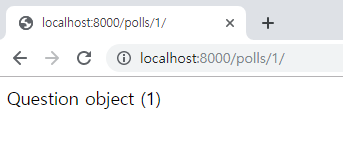

# Django 로 Polls App 만들기

## 여러가지 뷰 추가하기(2/4)
Poll app 에서는 다음과 같은 뷰를 통해 기능을 구현합니다.  
- 투표 목록: 등록된 투표의 목록을 표시하고 상세페이지로 이동하는 링크 제공
- 투표 상세: 투표의 상세 항목을 보여줌
- 투표 기능: 선택한 답변을 반영
- 투표 결과: 선택한 답변을 반영 한 후 결과를 보여줌

## 투표 상세
### url 작성
1. 등록된 투표 목록을 가져오는 url은 "http://ip.port/polls/5" 입니다.  
해당 API는 "polls/urls.py"에 등록합니다.
    ```python
    from django.urls import path

    from . import views
    

    urlpatterns = [
        # ex: /polls/
        path('', views.index, name='index'),
        # ex: /polls/5/
        path('<int:question_id>/', views.detail, name='detail'),
    ]
    ```
### view 작성
1. "polls/views.py" 에 "/polls/5"로 들어오는 url을 처리하기 위한 뷰를 추가 합니다.
    ```python
    def detail(request, question_id):
        return HttpResponse("You're looking at question %s." % question_id)
    ```
      

1. detail 뷰가 실제 투표 상세데이터를 가져와서 화면에 넘겨줄수 있도록 코드를 구현합니다.
    ```python
    from django.http import Http404
    from django.shortcuts import render

    from .models import Question
    
    
    def detail(request, question_id):
        try:
            question = Question.objects.get(pk=question_id)
        except Question.DoesNotExist:
            raise Http404("Question does not exist")
        return render(request, 'polls/detail.html', {'question': question})
    ```
1. "polls/templates/polls/detail.html"을 생성됩니다. 
1. "polls/templates/polls/detail.html"에 동작을 확인하기 위해 다음과 같이 입력합니다.
    ```
    {{question}}
    ```
1. 브라우저에서 "http://localhost:8000/polls/1/" 화면을 확인합니다.  
    

### 모델 함수 추가하기 
1. ```Question```모델과 ```Choice```모델에 ```__str__```메서드를 추가합니다.  
해당 메서드는 관리자 화면이나 쉘에서 객체를 출력할 때 나타날 내용을 결정합니다.
    ```python
    from django.db import models


    class Question(models.Model):
        question_text = models.CharField(max_length=200)
        pub_date = models.DateTimeField('date published')

        def __str__(self):
            return self.question_text

    class Choice(models.Model):
        question = models.ForeignKey(Question, on_delete=models.CASCADE)
        choice_text = models.CharField(max_length=200)
        votes = models.IntegerField(default=0)

        def __str__(self):
            return self.choice_text
    ```
1. 브라우저에서 "http://localhost:8000/polls/1/" 화면을 확인합니다.  
    

### get_object_or_404()
객체가 존재하지 않을 때 get() 을 사용하여 Http404 예외를 발생시키는 것은 자주 쓰이는 방법입니다.  
Django에서 이 기능에 대한 단축 기능을 제공합니다. detail() 뷰를 단축 기능으로 작성하면 다음과 같습니다.
```python
from django.shortcuts import get_object_or_404, render

def detail(request, question_id):
    question = get_object_or_404(Question, pk=question_id)
    return render(request, 'polls/detail.html', {'question': question})
```
get_object_or_404() 함수는 Django 모델을 첫번째 인자로 받고, 몇개의 키워드 인수를 모델 관리자의 get() 함수에 넘깁니다.  
만약 객체가 존재하지 않을 경우, Http404 예외가 발생합니다.  
또한, get_object_or_404() 함수처럼 동작하는 get_list_or_404() 함수가 있습니다.  
get() 대신 filter() 를 쓴다는 것이 다릅니다. 리스트가 비어있을 경우, Http404 예외를 발생시킵니다.

### Template 적용
1. "polls/templates/polls/detail.html"에 코드를 추가합니다.
```python
<h1>{{ question.question_text }}</h1>
<ul>

    <li>{{ choice.choice_text }}</li>

</ul>
```
1. 브라우저에서 "http://localhost:8000/polls/1/" 화면을 확인합니다.  
    

### 하드코딩된 URL 제거하기
"polls/index.html" 템플릿에 상세페이지로 이동하기 위한 링크주소가 하드코딩 되어있습니다.
```python
<li><a href="/polls/{{ question.id }}/">{{ question.question_text }}</a></li>
```
`````` template 태그를 사용하여 url 설정에 정의된 특정한 URL 경로들의 의존성을 제거할 수 있습니다
```python

<li><a href="">{{ question.question_text }}</a></li>

```
이는 polls.urls 모듈에 설정된 URL 정의에 따라 동작합니다.  

```python
path('<int:question_id>/', views.detail, name='detail'),
```
Ex)  question.id가 '5'일 경우,  ```{``` 템플릿 태그에 의해 호출 되는 url은 "/polls/5/" 이다.

### URL 네임스페이스 설정하기 
Django 프로젝트는 앱이 몇개라도 올 수 있습니다.  
각각의 앱이 동일한 뷰를 가지고 있다면 Django가 `````` 을 사용할 때 어떤 앱의 뷰를 URL을 생성할지 알 수 없습니다.  
URLconf("polls/urls.py")에 namespace를 추가하여 애플리케이션을 설정할 수 있습니다.
```python
app_name = 'polls'
urlpatterns = [
    path('', views.index, name='index'),
    path('<int:question_id>/', views.detail, name='detail'),
    path('<int:question_id>/results/', views.results, name='results'),
    path('<int:question_id>/vote/', views.vote, name='vote'),
]
```
"polls/index.html"를 아래와 같이 수정합니다.
```python

<li><a href="">{{ question.question_text }}</a></li>

```