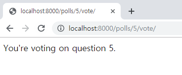

# Django 로 Polls App 만들기

## 여러가지 뷰 추가하기(3/4)
Poll app 에서는 다음과 같은 뷰를 통해 기능을 구현합니다.  
- 투표 목록: 등록된 투표의 목록을 표시하고 상세페이지로 이동하는 링크 제공
- 투표 상세: 투표의 상세 항목을 보여줌
- 투표 기능: 선택한 답변을 반영
- 투표 결과: 선택한 답변을 반영 한 후 결과를 보여줌

## 투표 기능

### url 작성
1. 투표를 하는 url은 "http://ip.port/polls/5/vote" 입니다.  
해당 API는 "polls/urls.py"에 등록합니다.
    ```python
    from django.urls import path

    from . import views
    

    urlpatterns = [
        # ex: /polls/
        path('', views.index, name='index'),
        # ex: /polls/5/
        path('<int:question_id>/', views.detail, name='detail'),
        # ex: /polls/5/vote/
        path('<int:question_id>/vote/', views.vote, name='vote'),
    ]
    ```

### view 작성
1. "polls/views.py" 에 "/polls/5/vote"로 들어오는 url을 처리하기 위한 뷰를 추가 합니다.
    ```python
    def vote(request, question_id):
        return HttpResponse("You're voting on question %s." % question_id)
    ```
      

### template 수정
1. 'polls/templates/polls/detail.html' 에 투표기능을 추가하기 위해 아래와 같이 코드를 수정합니다.  
    ```python
    
    <h1>{{ question.question_text }}</h1>

    <p><strong>{{ error_message }}</strong></p>

    <form action="" method="post">
    
    
        <input type="radio" name="choice" id="choice{{ forloop.counter }}" value="{{ choice.id }}">
        <label for="choice{{ forloop.counter }}">{{ choice.choice_text }}</label><br>
    
    <input type="submit" value="Vote">
    </form>
    
    ```

### view 수정
1. "polls/views.py"에 다음을 추가합니다.  
설문조사에 설문을 하고난 뒤에는, vote() 뷰는 설문조사 결과 페이지로 리다이렉트합니다.
    ```python
    from django.http import HttpResponseRedirect
    from django.urls import reverse

    from .models import Choice


    def vote(request, question_id):
        question = get_object_or_404(Question, pk=question_id)
        try:
            selected_choice = question.choice_set.get(pk=request.POST['choice'])
        except (KeyError, Choice.DoesNotExist):
            # Redisplay the question voting form.
            return render(request, 'polls/detail.html', {
                'question': question,
                'error_message': "You didn't select a choice.",
            })
        else:
            selected_choice.votes += 1
            selected_choice.save()
            # Always return an HttpResponseRedirect after successfully dealing
            # with POST data. This prevents data from being posted twice if a
            # user hits the Back button.
            return HttpResponseRedirect(reverse('polls:results', args=(question.id,)))
    ```