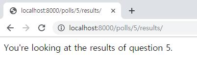

# Django 로 Polls App 만들기

## 여러가지 뷰 추가하기(4/4)
Poll app 에서는 다음과 같은 뷰를 통해 기능을 구현합니다.  
- 투표 목록: 등록된 투표의 목록을 표시하고 상세페이지로 이동하는 링크 제공
- 투표 상세: 투표의 상세 항목을 보여줌
- 투표 기능: 선택한 답변을 반영
- 투표 결과: 선택한 답변을 반영 한 후 결과를 보여줌

## 투표 결과
### url 작성
1. 투표결과 목록을 가져오는 url은 "http://ip.port/polls/5/results" 입니다.  
해당 API는 "polls/urls.py"에 등록합니다.
    ```python
    from django.urls import path

    from . import views
    

    urlpatterns = [
        # ex: /polls/
        path('', views.index, name='index'),
        # ex: /polls/5/
        path('<int:question_id>/', views.detail, name='detail'),\
        # ex: /polls/5/vote/
        path('<int:question_id>/vote/', views.vote, name='vote'),
        # ex: /polls/5/results/
        path('<int:question_id>/results/', views.results, name='results'),
    ]
    ```
### view 작성
1. "polls/views.py" 에 "/polls/5/results"로 들어오는 url을 처리하기 위한 뷰를 추가 합니다.
    ```python
    def results(request, question_id):
        response = "You're looking at the results of question %s."
        return HttpResponse(response % question_id)
    ```
      
1. view를 수정합니다.
    ```python
    def results(request, question_id):
        question = get_object_or_404(Question, pk=question_id)
        return render(request, 'polls/results.html', {'question': question})
    ````

### template 작성
1. "polls/results.html" 를 생성하여 작성합니다.
    ```python
    <h1>{{ question.question_text }}</h1>

    <ul>
    
        <li>{{ choice.choice_text }} -- {{ choice.votes }} vote{{ choice.votes|pluralize }}</li>
    
    </ul>

    <a href="">Vote again?</a>
    ```

