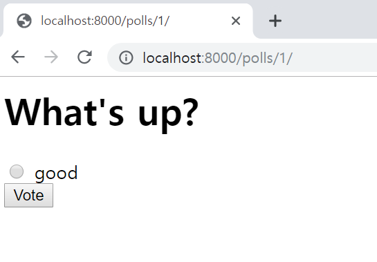

# Django 로 Polls App 만들기

## Polls App 소개
이 튜토리얼을 통해, 간단한 설문조사(Polls) 어플리케이션을 만드는 과정을 따라해 보겠습니다.

두 파트로 구성되어 있습니다.

- 사람들이 설문 내용을 보고 직접 투표할 수 있는 개방된 사이트  
- 관리자가 설문을 추가, 변경, 삭제할 수 있는 관리용 사이트  

개발이 완료된 간단한 화면은 아래와 같습니다.  
1. 설문 목록화면  
  
1. 설문 상세화면  
  
1. 설문 투표결과 화면  
  

설문을 등록하는 화면은 아래와 같습니다. 장고기능 중 Admin 기능을 활용합니다.  
1. 설문 등록화면  
  

1. 선택항목 등록화면  
  