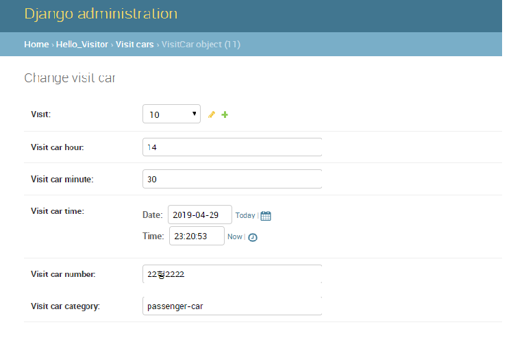

# django admin
django에서 제공하는 admin app을 사용하여 model에 대한 data를 편리하게 조회 변경할 수 있습니다
admin app을 사용하기 위한 설정방법은 다음과 같습니다  
```
1. admin app 사용 table 생성
  > python manage.py migrate admin
2. settings.py파일의 INSTALLED_APPS에 admin app 등록 확인
   project 생성시 기본으로 설정되어 있습니다
   INSTALLED_APPS = [
      'django.contrib.admin',
      ...
   ]
3. admin.py에 추가한 model을 다음과 같이 등록합니다
  admin.site.register(Visit)
```

browser에서 다음  url을 입력하여(http://localhost:8000/admin/) 사용합니다  

