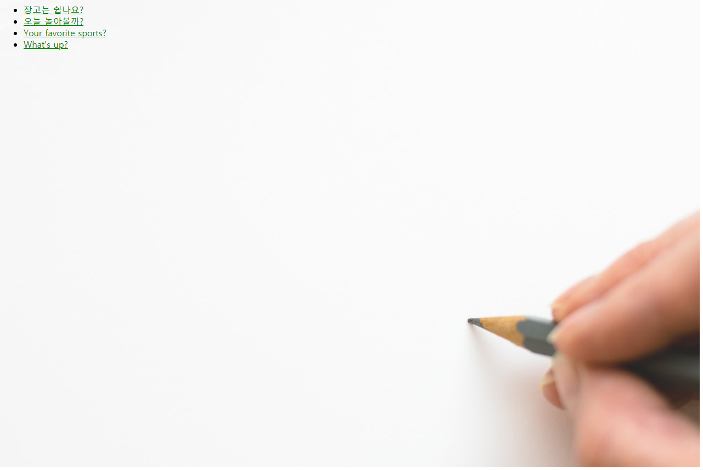

# Django 로 Polls App 만들기

## look and feel 바꾸기
1. ```polls```디렉토리에 ```static``` 디렉토리를 만듭니다.
1. 방금 생성 한 ```static``` 디렉토리 안에 ```polls``` 라는 디렉토리를 만듭니다.  
template 설정시 namespace를 사용했던것과 동일하게 정적파일도 namespace를 활용하여 구분하는 것이 좋습니다.
1. ```polls/static/polls/style.css``` 파일을 생성하여 작성합니다.
    ```css
    li a {
        color: green;
    }
    ```
1. ```polls/templates/polls/index.html``` 상단에 추가합니다.
    ```html
    

    <link rel="stylesheet" type="text/css" href="">
    ```
1. Django의 정적파일을 찾는 default 설정은 ```AppDirectoriesFinder``` 로,  ```settings.py``` 파일의 ```INSTALLED_APPS``` 설정에 등록된 각각의 앱에서 ```static``` 이라는 서디렉토리를 찾습니다.
1. `````` 이라는 템플릿 테그는 정적파일의 절대경로(URL)를 생성합니다.

## 배경 이미지 추가하기
1. ```polls/static/polls/style.css``` 에 다음을 추가하세요
    ```css
    body {
        background: white url("images/background.jpg") no-repeat;
    }
    ```
1. ```polls/static/polls/images``` 폴더를 생성합니다.  
1. <a href="image/background.jpg" download="background.jpg"></a>이미지를 다운로드 받아 ```polls/static/polls/images/``` 디렉토리 밑에 ```"background.jpg"``` 명으로 저장합니다.   
1. "http://localhost:8000/polls"로 접속하여 다음과 같은 결과를 확인합니다.  
    