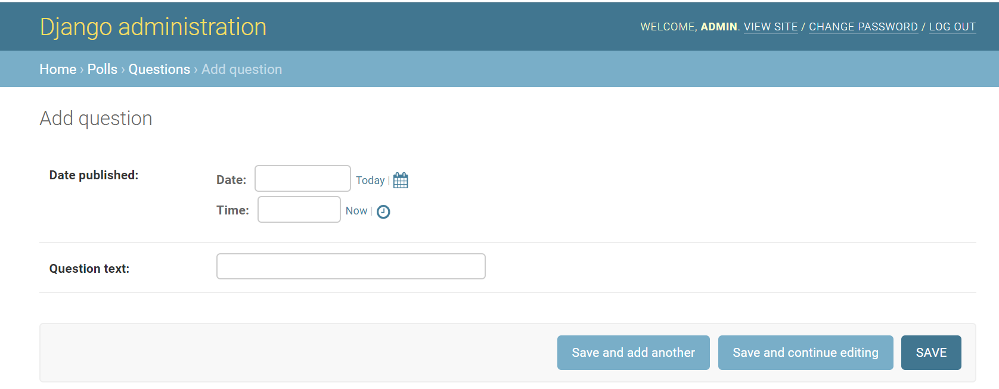
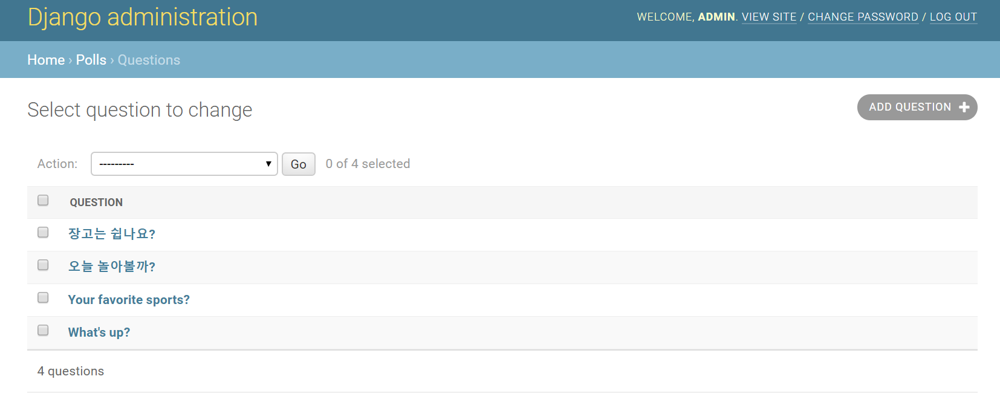

# Django 로 Polls App 만들기

## Admin Form  바꾸기
```polls/admin.py```에 원하는 모델을 resister 함으로써 장고의 어드민 폼 화면을 활용할 수 있었습니다.  
Admin Form 화면을 커스터 마이징하는 방법에 대해 보도록 하겠습니다.

1. ```polls/admin.py``` 파일에 ```admin.site.register(Question)```를 변경합니다.
    ```python
    class QuestionAdmin(admin.ModelAdmin):
        fields = ['pub_date', 'question_text']

    admin.site.register(Question, QuestionAdmin)
    ```
    Date published와 Question text 순서가 변경됩니다.  
    

1. 필드의 수가 많다면 fieldset으로 폼을 분할하여 그룹화 할수 있습니다.
    ```python
    class QuestionAdmin(admin.ModelAdmin):
        fieldsets = [
            (None,               {'fields': ['question_text']}),
            ('Date information', {'fields': ['pub_date']}),
        ]

    admin.site.register(Question, QuestionAdmin)
    ```
    

1. "Choices" 의 경우 "Questions" 와의 ForeignKey 관계를 Admin Form에서는 다음과 같이 ```select box```로 표현하고 있습니다.
      
    Question 객체를 생성할 때 여러 개의 Choices를 직접 추가할 수 있도록 수정해 봅니다.
    ```python
    class ChoiceInline(admin.StackedInline):
        model = Choice
        extra = 3


    class QuestionAdmin(admin.ModelAdmin):
        fieldsets = [
            (None,               {'fields': ['question_text']}),
            ('Date information', {'fields': ['pub_date'], 'classes': ['collapse']}),
        ]
        inlines = [ChoiceInline]
    ```
      

1. ```StackedInline``` 대신에 ```TabularInline```을 사용하면, 관련된 객체는 좀 더 조밀하고 테이블 기반 형식으로 표시됩니다:
    ```python
    class ChoiceInline(admin.TabularInline):
        ...
    ```
      

### 관리자 변경 목록(change list) 커스터마이징
1. 현재 change list 페이지의 모습입니다.
      

1. ```list_display``` 옵션을 사용하여 목록의 컬럼에 표시할 필드를 정의할 수 있습니다.
    ```python
    class QuestionAdmin(admin.ModelAdmin):
        # ...
        list_display = ('question_text', 'pub_date', 'was_published_recently')
    ```
      

1. was_published_recently 헤더의 경우를 제외하고 그 값으로 정렬하기 위해 열 머리글을 클릭 할 수 있습니다.  
왜냐하면 임의의 메서드의 출력에 의한 정렬은 지원되지 않기 때문입니다.  
또한 was_published_recently에 대한 열 머리글은 기본적으로 메서드 이름 (밑줄을 공백으로 대체)이며 각 줄에는 출력의 문자열 표현이 포함되어 있습니다.  
```polls/models.py```을 수정하여 기능을 추가할 수 있습니다.
    ```python
    class Question(models.Model):
        # ...
        def was_published_recently(self):
            now = timezone.now()
            return now - datetime.timedelta(days=1) <= self.pub_date <= now
        was_published_recently.admin_order_field = 'pub_date'
        was_published_recently.boolean = True
        was_published_recently.short_description = 'Published recently?'
    ```
      

1. ```polls/admin.py```에 ```list_filter```를 사용하도록 ```QuestionAdmin```에 추가합니다.
    ```python
    list_filter = ['pub_date']
    ```
      
    표시되는 필터의 유형은 필터링중인 필드의 유형에 따라 다릅니다.   
    pub_date는 DateTimeField이므로, Django는 "Any date", "Today", "Past 7 days", "This month", "This year" 등의 적절한 필터 옵션을 제공합니다.  

1. change list 페이지에 검색창을 추가해 봅니다. ```QuestionAdmin```에 추가합니다.
    ```python
    search_fields = ['question_text']
    ```
      

### 관리자 룩앤필 커스터마이징
1. 프로젝트 디렉토리 (manage.py를 포함하고있는)에 ```templates/admin``` 디렉토리를 만듭니다.
1. [base_site.html](files/base_site.html) 을 다운로드 받아 ```templates/admin```디렉토리에 저장합니다.
1. ```myfirstapp/config/settings.py``` 파일에 ```DIRS``` 옵션을 ```TEMPLATES``` 설정에 추가합니다.
```python
TEMPLATES = [
    {
        'BACKEND': 'django.template.backends.django.DjangoTemplates',
        'DIRS': [os.path.join(BASE_DIR, 'templates')],
        'APP_DIRS': True,
        'OPTIONS': {
            'context_processors': [
                'django.template.context_processors.debug',
                'django.template.context_processors.request',
                'django.contrib.auth.context_processors.auth',
                'django.contrib.messages.context_processors.messages',
            ],
        },
    },
]
```
1. ```templates/admin/base_site.html``` 파일의 ```{{site_header|default:_ ('Django administration' }}``` 부분을 제거하고 원하는 이름으로 변경합니다.
    ```python
    
    <h1 id="site-name"><a href="">Polls Administration</a></h1>
    
    ```
      
